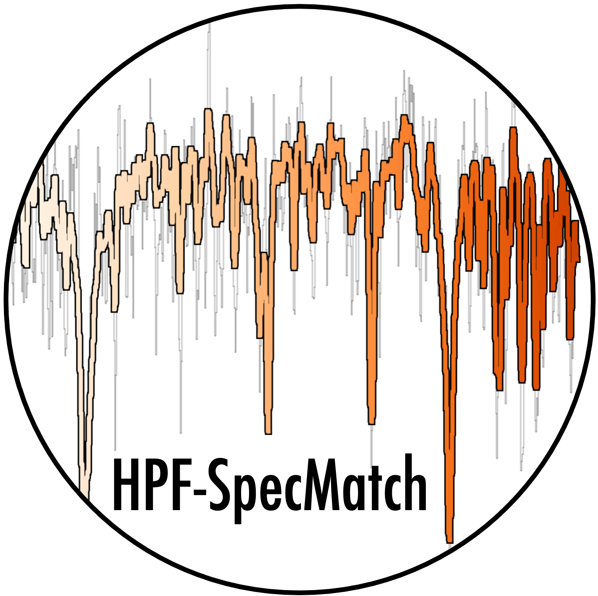

# hpfspecmatch
HPF SpecMatch: Spectral matching of HPF data



# Installation

```
git clone git@github.com:gummiks/hpfspecmatch.git
cd hpfspecmatch
python setup.py install
```

# Dependencies 

- pyde, either (pip install pyde) or install from here: https://github.com/hpparvi/PyDE This package needs numba (try 'conda install numba' if problems).
- emcee (pip install emcee)
- crosscorr (git clone git@github.com:gummiks/crosscorr.git)
- hpfspec (git clone git@github.com:gummiks/hpfspec.git)
- astroquery (pip install astroquery)
- lmfit (pip install lmfit)
- barycorrpy (pip install barycorrpy)

# Quick start
See example notebooks in the notebook folder, which gives an example of how to fit TOI-1468.
You will need to download an example HPF spectral library and put in the library/ folder. 
See instructions in the librarary/readme.md file, or in the example notebook.

## New library (as of Oct 8, 2020)
See new notes on experimental library from Oct 8 2020
