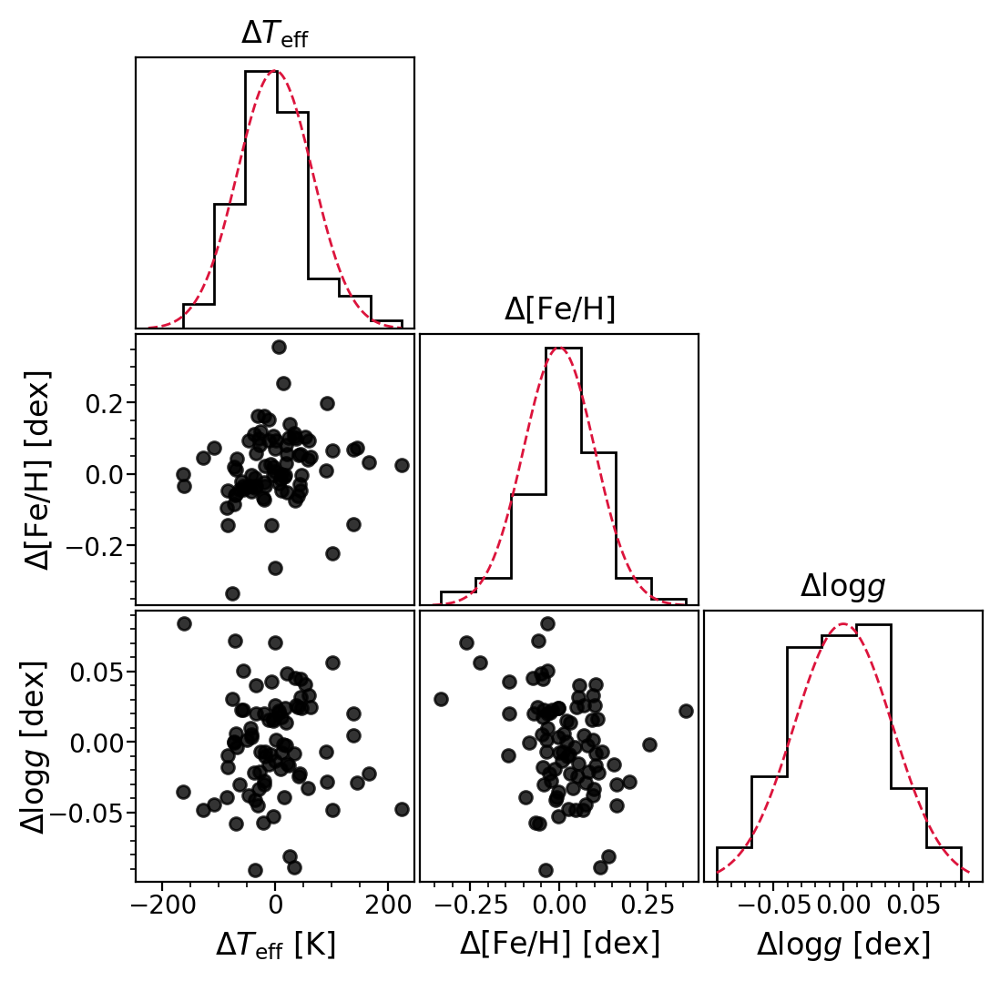

# Cross-validation

## Import packages


```python
from importlib import reload
import os
import glob2
import pandas as pd
pd.set_option('display.max_columns', 50)
pd.set_option('display.max_rows', 500)
import numpy as np
import sys
import hpfspec
import hpfspecmatch
```

## Read in Library


```python
# download library if does not exist
hpfspecmatch.utils.get_library()
```

```python
# List of stellar library fits files
library_fitsfiles = hpfspecmatch.config.LIBRARY_FITSFILES

# Read in all files as a HPFSpecList object
HLS = hpfspec.HPFSpecList(filelist=library_fitsfiles)
```

```python
HLS.splist
```

```python
# Read in library
df_lib = pd.read_csv(hpfspecmatch.config.PATH_LIBRARY_DB)
df_lib
```


## Running Cross-validation for Order 17


```python
# suppress plots in ipython notebook
%matplotlib agg

# run crossvalidation for order 17
order = '17'
df_lib_compare = hpfspecmatch.run_crossvalidation_for_orders(order, df_lib, HLS, plot_results = True)
```


## Plot 1D Performance


```python
%matplotlib inline # enable plots in ipython notebook
order = '17'
df_crossval = pd.read_csv('../library/20210406_specmatch_nir_library/crossval/o{}_crossval/crossvalidation_resuls_o{}.csv'.format(order,order))
savefolder = '../library/20210406_specmatch_nir_library/crossval/o{}_crossval'.format(order)
hpfspecmatch.plot_crossvalidation_results_1d(order,df_crossval,savefolder)
```


## Plot 2D Performance


```python
order = '17'
df_crossval = pd.read_csv('../library/20210406_specmatch_nir_library/crossval/o{}_crossval/crossvalidation_resuls_o{}.csv'.format(order,order))
savefolder = '../library/20210406_specmatch_nir_library/crossval/o{}_crossval'.format(order)
hpfspecmatch.plot_crossvalidation_results_2d(order,df_crossval,savefolder)
```




## Cross-validation Errors


```python
order = '17'
df_crossval = pd.read_csv('../library/20210406_specmatch_nir_library/crossval/o{}_crossval/crossvalidation_resuls_o{}.csv'.format(order,order))
```


```python
np.std(df_crossval.d_teff.values)
```

```python
np.std(df_crossval.d_feh)
```

```python
np.std(df_crossval.d_logg)
```
