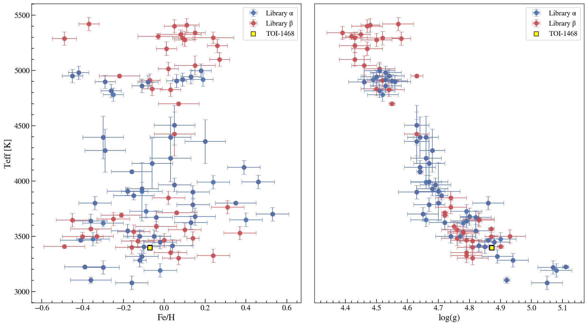

# Installation

There are two main ways to install `HPF-SpecMatch`:


## From Git
`HPF-SpecMatch` can be installed from Git in the following way:
```
git clone git@github.com:gummiks/hpfspecmatch.git
cd hpfspecmatch
python setup.py install
```

## From pip
`HPF-SpecMatch` can be installed from pip with the following command:
```
pip install hpfspecmatch 
```

## Stellar Library

`HPF-SpecMatch` relies on an extensive library of high-resolution HPF spectra.<br /> Let's set it up for use.

Access and download the stellar library [**here**](https://www.dropbox.com/s/69j00zrpov48qwx/20201008_specmatch_nir.zip?dl=0)

Unzip this data in the ../library/ folder such that the directories are structured:

- ../library/20201008_specmatch_nir/20201008_specmatch_nir.csv
- ../library/20201008_specmatch_nir/FITS/



## Dependencies
*is this the best/easiest/most readable way to display dependencies?*

- pyde, either (pip install pyde) or install from here: https://github.com/hpparvi/PyDE This package needs numba (try 'conda install numba' if problems).
- emcee (pip install emcee)
- crosscorr (git clone git@github.com:gummiks/crosscorr.git)
- hpfspec (git clone git@github.com:gummiks/hpfspec.git)
- astroquery (pip install astroquery)
- lmfit (pip install lmfit)
- barycorrpy (pip install barycorrpy)

